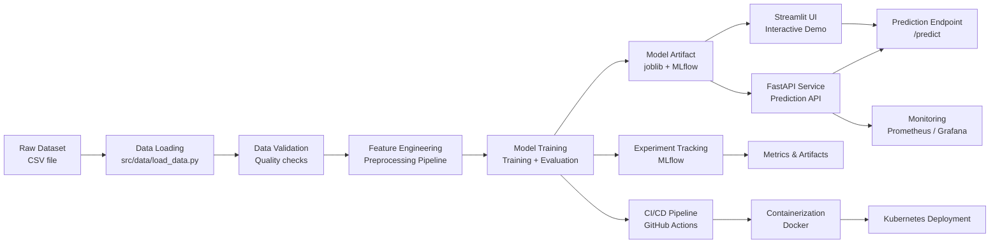

# Architecture Diagram

```mermaid
flowchart LR
    A[Raw Dataset<br/>CSV file] --> B[Data Loading<br/>src/data/load_data.py]
    B --> C[Data Validation<br/>Quality checks]
    C --> D[Feature Engineering<br/>Preprocessing Pipeline]
    D --> E[Model Training<br/>Training + Evaluation]
    E --> F[Model Artifact<br/>joblib + MLflow]

    F --> G[FastAPI Service<br/>Prediction API]
    F --> H[Streamlit UI<br/>Interactive Demo]

    G --> I[Prediction Endpoint<br/>/predict]
    H --> I

    E --> J[Experiment Tracking<br/>MLflow]
    J --> K[Metrics & Artifacts]
    G --> L[Monitoring<br/>Prometheus / Grafana]
    E --> M[CI/CD Pipeline<br/>GitHub Actions]
    M --> N[Containerization<br/>Docker]
    N --> O[Kubernetes Deployment]
```

This diagram reflects the end-to-end flow of the project from data ingestion to model serving, monitoring, and deployment.
